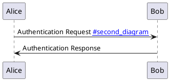
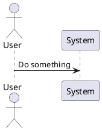

# PlantUML Diagrams

Here is the first diagram, which links to the second diagram.

```plantuml
@startuml first_diagram
Alice -> Bob: Authentication Request [[#second_diagram]]
Bob -> Alice: Authentication Response
@enduml
```

## Second Diagram

Here is the second diagram.

```plantuml
@startuml second_diagram
actor User
User -> System: Do something
@enduml
```
