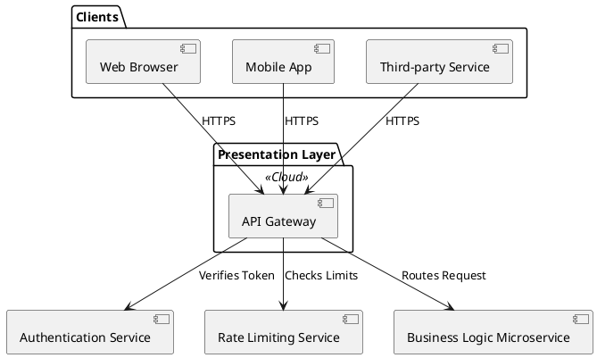
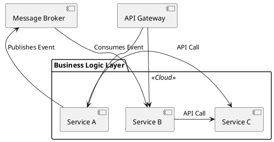
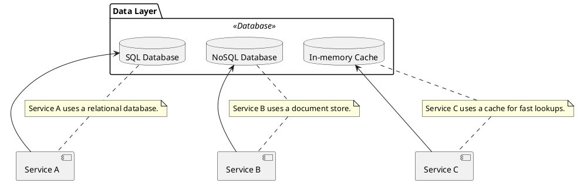

# 3-Layer Microservices Architecture

This document outlines a common architectural pattern for microservices, separating concerns into three distinct layers: the Presentation Layer, the Business Logic Layer, and the Data Layer.

## High-Level Architecture

Below is a high-level diagram of the 3-layer architecture. Each component in the diagram links to a more detailed section below.

```plantuml
@startuml
skinparam rectangle {
    BorderColor #555
    BackgroundColor #EEE
}

package "User Interface" {
  [Web Browser]
  [Mobile App]
}

package "Presentation Layer" <<Cloud>> {
  [API Gateway [[#presentation-layer]]]
}

package "Business Logic Layer" <<Cloud>> {
  [Service A [[#business-logic-layer]]]
  [Service B [[#business-logic-layer]]]
  [Service C [[#business-logic-layer]]]
}

package "Data Layer" <<Database>> {
  [Database A [[#data-layer]]]
  [Database B [[#data-layer]]]
  [Database C [[#data-layer]]]
}

[Web Browser] --> [API Gateway]
[Mobile App] --> [API Gateway]

[API Gateway] --> [Service A]
[API Gateway] --> [Service B]
[API Gateway] --> [Service C]

[Service A] --> [Database A]
[Service B] --> [Database B]
[Service C] --> [Database C]

@enduml
```

<a name="presentation-layer"></a>
## Presentation Layer

This layer is responsible for handling user-facing requests and returning responses. It's the entry point for all client interactions. The primary component of this layer is often an API Gateway, which provides a single, unified entry point for all clients.

The API Gateway can handle tasks such as:
- **Authentication and Authorization:** Verifying the identity of the user and enforcing access controls.
- **Request Routing:** Directing incoming requests to the appropriate microservice in the business logic layer.
- **Rate Limiting:** Protecting the system from being overwhelmed with requests.
- **SSL Termination:** Offloading the work of encrypting and decrypting HTTPS traffic.
- **Caching:** Storing responses to common requests to reduce latency.



<a name="business-logic-layer"></a>
## Business Logic Layer

This layer contains the core business logic of the application. It's composed of multiple microservices, each responsible for a specific business capability. This is where the main work of the application is done.

Each microservice should be:
- **Highly Cohesive:** Focused on a single business capability.
- **Loosely Coupled:** Independent of other microservices, allowing them to be developed, deployed, and scaled independently.
- **Communicating via APIs:** Microservices interact with each other through well-defined APIs, typically using protocols like HTTP/REST, gRPC, or message queues.



<a name="data-layer"></a>
## Data Layer

This layer is responsible for data persistence and retrieval. A key principle of microservices architecture is that each service manages its own data. This is known as "database per service."

This approach offers several advantages:
- **Data Encapsulation:** Services can't bypass the API to access the database directly, ensuring data consistency.
- **Technology Diversity:** Each service can choose the database technology that best suits its needs (e.g., SQL, NoSQL).
- **Independent Scaling:** The database for a high-traffic service can be scaled independently of others.

Data can be synchronized between services using patterns like:
- **API Composition:** A service queries other services' APIs to get the data it needs.
- **Event-Driven Architecture:** Services publish events when their data changes, and other services subscribe to these events to update their own local data stores.


